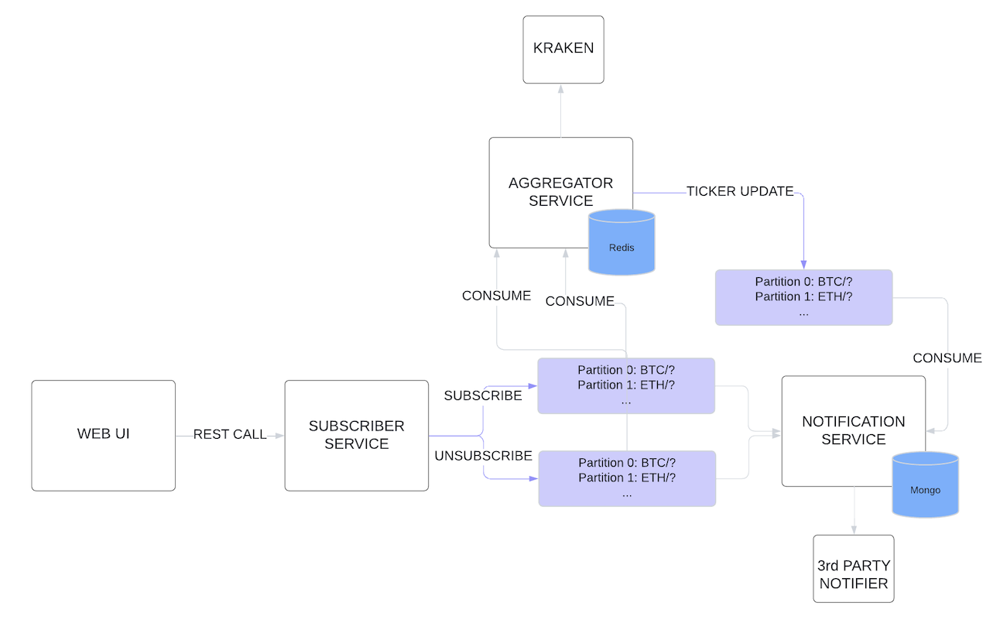

# Crypto Notification System

The **Crypto Notification System** is a microservices-based application that allows users to subscribe to cryptocurrency price updates and receive notifications via various channels when certain thresholds are met. This system leverages Docker for containerization, Kafka for messaging, and a lightweight Makefile for managing builds and operations.

## Table of Contents
- [Architecture Overview](#architecture-overview)
- [Services](#services)
  - [Aggregator Service](#aggregator-service)
  - [Subscriber Service](#subscriber-service)
  - [Notification Service](#notification-service)
- [Technologies Used](#technologies-used)
- [Running the System](#running-the-system)
  - [Prerequisites](#prerequisites)
  - [Makefile Commands](#makefile-commands)
  - [Build and Run](#build-and-run)
- [API Endpoints](#api-endpoints)

## Architecture Overview

The system is composed of several microservices that interact with each other through Kafka topics. The core components include:
- **Aggregator Service**: Collects and aggregates data from cryptocurrency exchanges.
- **Subscriber Service**: Manages user subscriptions for cryptocurrency price change notifications.
- **Notification Service**: Sends notifications to users when price thresholds are met.

Kafka is used as the message broker to handle communication between the services, and Zookeeper is used to coordinate the Kafka cluster.



## Services

### Aggregator Service
The **Aggregator Service** is responsible for fetching real-time cryptocurrency price data from Kraken exchange and publishing ticker updates to "ticker" Kafka topic.
It's using redis to track how many users are subscribed to a ticker and if they are more than 1, it send a message via websocket to kraken to get updates for the given ticker. When the subscribers for a given ticker are 0, it sends unsubscribe message to the kraken websocket api.

### Subscriber Service
The **Subscriber Service** handles user subscriptions and unsubscriptions to specific cryptocurrency tickers. It is a REST API server that emits subscribe/unsubscribe events. It is not stateful.

### Notification Service
The **Notification Service** sends notifications to users based on their subscription preferences when certain price thresholds are met. It uses mongodb to persist the user perferences.
Supports Email and Slack notifications.

## Technologies Used
- **Golang**: Used for developing the microservices.
- **Docker**: Used to containerize the services.
- **Kafka**: Message broker for communication between services.
- **Zookeeper**: Coordinates the Kafka cluster.
- **MongoDB**: Database for storing user subscriptions and notification preferences.
- **Redis**: Used for caching the ticker -> users mapping
- **Gin**: Web framework used for the HTTP REST API.
- **Alpine Linux**: Lightweight base image for Docker containers.

## Running the System

### Prerequisites
- **Docker** and **Docker Compose** should be installed on your machine.
- **Make** should be installed to use the Makefile commands.

### Makefile Commands

- **`up`**: Starts all containers in the background without forcing a rebuild.
  ```bash
  make up
  ```
- **`up_build`**: Stops running Docker containers, builds all services, and then starts the containers.
  ```bash
  make up_build
  ```
- **`down`**: Stops all running Docker containers.
  ```bash
  make down
  ```
- **`build_subscriber`**: Builds the Subscriber Service binary as a Linux executable.
  ```bash
  make build_subscriber
  ```
- **`build_aggregator`**: Builds the Aggregator Service binary as a Linux executable.
  ```bash
  make build_aggregator
  ```
- **`build_notification`**: Builds the Notification Service binary as a Linux executable.
  ```bash
  make build_notification
  ```

### Build and Run

1. Clone the repository:
   ```bash
   git clone https://github.com/your-repo/crypto-notification-system.git
   cd crypto-notification-system
   ```

2. Modify the notification-service env vars in docker-compose.yml:
    ```yml
      SMTP_USER: youremail
      SMTP_PASS: password
    ```

3. To build all services and start the system:
   ```bash
   make up_build
   ```

4. To start the system without rebuilding:
   ```bash
   make up
   ```

5. To stop all running services:
   ```bash
   make down
   ```

### API Endpoints

#### Subscriber Service

- **Subscribe to a Ticker**
  ```bash
  curl -X POST http://localhost:8080/subscribe \
  -H "Content-Type: application/json" \
  -d '{
    "userID": "user123",
    "tickers": [
      {"symbol": "BTC/USD", "changeThreshold": 5.0},
      {"symbol": "ETH/USD", "changeThreshold": 10.0}
    ],
    "notificationOptions": {
      "slackWebhookURL": "https://hooks.slack.com/services/...",
      "email": "user@example.com",
      "phoneNumber": "+1234567890"
    }
  }'
  ```

- **Unsubscribe from a Ticker**
  ```bash
  curl -X POST http://localhost:8080/unsubscribe \
  -H "Content-Type: application/json" \
  -d '{
    "userID": "user123",
    "tickers": [
      {"symbol": "BTC/USD", "changeThreshold": 5.0},
      {"symbol": "ETH/USD", "changeThreshold": 10.0}
    ]
  }'
  ```

### Debugging services in docker

1. Uncomment dlv debugger installation and start in the Dockerfiles:

```bash
# RUN CGO_ENABLED=0 go install -ldflags "-s -w -extldflags '-static'" github.com/go-delve/delve/cmd/dlv@v1.21.0

# CMD [ "/go/bin/dlv", "--listen=:4000", "--headless=true", "--log=true", "--accept-multiclient", "--api-version=2", "exec", "/app/subscriberService"]
```

2. Create the following launch.json file in VsCode:

```json
{
  "version": "0.2.0",
  "configurations": [
    {
      "name": "Connect to server",
      "type": "go",
      "request": "attach",
      "mode": "remote",
      "remotePath": "${workspaceFolder}",
      "port": 4000,
      "host": "127.0.0.1"
    }
  ]
}
```

3. Start the compose. NOTE: the application will not start until the debugger is attached

### TODOs

1. notification-servcie: Telephone notifications
2. aggregator-service: Graceful websocket disconnection
3. all services: Topic partitions - BTC/? | ETH/? | etc.